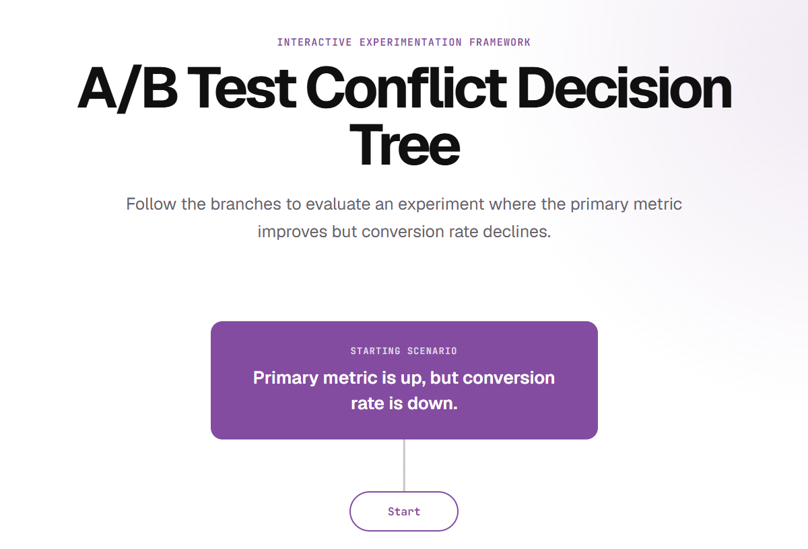

# A/B Test Conflict Decision Assistant

An interactive Flask application that transforms an A/B testing decision
framework into a guided branching decision tree.

The tool helps product teams evaluate situations where the primary
experiment metric improves, but conversion rate declines, and provides a
structured recommendation based on the answers selected.

## Demo

## Overview

A/B testing decisions are not always straightforward.

An experiment may show: 

- Improvement in the primary success metric 
- A decline in conversion rate

This creates a decision conflict: 
- Should the experiment launch? 
- Is the conversion decline meaningful? 
- Does the impact affect a specific customer segment? 
- Is there a usability or trust issue? 
- Should the experiment be redesigned?

This project recreates that decision-making process as an interactive
tree, guiding users through each question until reaching a final
recommendation.

## Features

-   Interactive branching decision tree
-   Question-based navigation flow
-   Visual representation of A/B test decision tree framework logic
-   Multiple recommendation outcomes
-   Restart functionality to explore different scenarios
-   Responsive interface
-   Rule-based decision engine

## Tech Stack

Backend: 

- Python 
- Flask

Frontend: 

- HTML 
- CSS 
- JavaScript

Logic: 

- Rule-based decision tree engine

## Project Structure

ab-test-conflict-decision-assistant/

├── app.py 
├── decision_engine.py 
├── requirements.txt 
├── README.md 
├── LICENSE 
├── static/ 
│ ├── css/ 
│ │ └── style.css
│ ├── images/
│ │ ├── decision-tree.png 
│ │ └── demo.png 
│ └── js/ 
│   └── tree.js 
├── templates/ 
│ └── index.html 
└── tests/ 
  └── test_tree.py
  
## Running Locally

Clone the repository:

git clone
https://github.com/simaworx/ab-test-conflict-decision-assistant.git

Navigate into the project:

    cd ab-test-conflict-decision-assistant

Create virtual environment:

    python -m venv .venv

Activate environment:

    Windows: .venv

    Mac/Linux: source .venv/bin/activate

Install dependencies:

    pip install -r requirements.txt

Run application:

    python app.py

Open in browser:

    http://127.0.0.1:5000

## Testing

Run:

 pytest

## Why I Built This

In product analytics, experiment results often require judgement rather
than a simple winner/loser decision.

This project explores how analytical frameworks and experimentation
principles can be converted into practical tools that help teams make
more consistent and informed decisions.

## Author

Simona Sukyte

Product Data Analyst focused on: 
- Product analytics 
- A/B testing 
- Data visualisation 
- Dashboard development 
- Workflow automation
